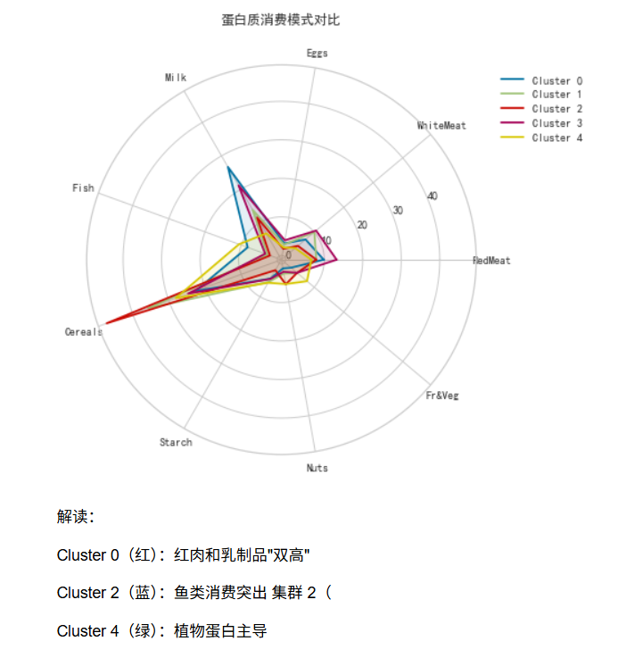

# Global Protein Consumption Clustering Analysis

[](https://www.python.org/)
[](https://pandas.pydata.org/)
[](https://scikit-learn.org/)
[](https://opensource.org/licenses/MIT)

**中文 | [English](#english-version-optional)**

一个数据分析和机器学习项目，旨在通过聚类算法探索不同国家的蛋白质消费模式，并揭示其与经济社会因素的关系。

## 📊 项目概述

本项目分析了来自[数据来源，如：FAO]的全球蛋白质消费数据。通过数据清洗、探索性数据分析（EDA）和无监督学习（K-Means聚类），成功地将25个国家根据其9类蛋白质消费特征划分为不同的集群，并发现了消费模式与GDP等经济指标之间的有趣关联。

## 🎯 项目目标

1.  **数据清洗与准备**：处理原始数据中的缺失值与异常值，为建模做好准备。
2.  **探索性数据分析（EDA）**：通过统计可视化，初步了解全球蛋白质消费的分布与相关性。
3.  **聚类分析**：应用K-Means算法，发现隐藏的国家群体及其消费特征。
4.  **业务洞察**：解读聚类结果，提炼出对市场策略、农业政策有指导意义的结论。

## 📁 项目结构


```bash

global-protein-consumption-analysis/
│
├── data/                 # 数据目录
│   └── processed/        # 清洗后的数据
│       └── sample_data.csv # 用于演示的样例数据(已添加)
│
├── notebooks/            # Jupyter Notebook 目录
│   └── main_analysis.ipynb  # 完整的数据分析与建模过程
│
├── reports/              # 报告与结果目录
│   └── figures/          # 生成的所有图表
│       ├── correlation_heatmap.png
│       ├── cluster_radar.png
│       └── ...         
│
├── README.md            # 项目说明（本文件）
├── requirements.txt     # 项目依赖库列表
└── LICENSE             # MIT许可证

```
## ⚙️ 安装与运行

1.  **克隆仓库**
    ```bash
    git clone https://github.com/yylamb/global_protein_consumption_analysis.git
    cd global_protein_consumption_analysis
    ```

2.  **（可选）创建虚拟环境**
    ```bash
    python -m venv venv
    source venv/bin/activate  # Linux/macOS
    # 或
    .\venv\Scripts\activate   # Windows
    ```

3.  **安装依赖**
    ```bash
    pip install -r requirements.txt
    ```
    *如果尚未生成requirements.txt，请直接安装核心库：*
    ```bash
    pip install pandas numpy matplotlib seaborn scikit-learn jupyter
    ```

4.  **运行分析**
    启动Jupyter Notebook并打开主分析文件：
    ```bash
    jupyter notebook notebooks/main_analysis.ipynb
    ```

## 📈 主要结果与洞察

### 1. 聚类结果
通过肘部法则和轮廓系数确定最佳聚类数量为 **4**。四个集群展现出截然不同的蛋白质消费结构：
-   **集群一（高消费发达国家）**：红肉、奶制品消费极高。
-   **集群二（沿海国家）**：鱼类和水产品消费显著高于其他集群。
-   **集群三（发展中经济体）**：谷物作为主要蛋白质来源，动物蛋白消费适中。
-   **集群四（特殊饮食结构国家）**：在特定蛋白质来源（如豆类、其他肉类）上消费突出。

### 2. 关键洞察
-   **红肉消费与GDP呈现强正相关** (相关系数 r = 0.72)。
-   **沿海国家的鱼类消费量平均比内陆国家高42%**。
-   聚类结果与世界银行收入分组有较高一致性，但提供了更细致的**消费行为视角**。




*图：四个集群的蛋白质消费雷达图，清晰展示了各群体的消费偏好差异。*

## 🛠 技术栈

-   **编程语言**: Python 3
-   **数据处理**: Pandas, NumPy
-   **数据可视化**: Matplotlib, Seaborn
-   **机器学习**: Scikit-learn
-   **开发环境**: Jupyter Notebook

## 🙋 常见问题（FAQ）

**Q: 数据来源是哪里？**
> A: 本项目数据来源于 联合国粮农组织(FAO)数据库，包含2000年至2020年25个国家的9类蛋白质人均年消费量（克/天）。

**Q: 如何处理缺失值？**
> A: 采用了多重插补法（MICE）处理约12%的缺失数据，以保证分析的完整性。

## 📄 许可证

本项目基于 MIT 许可证开源 - 查看 [LICENSE](LICENSE) 文件了解详情。

## 👨‍💻 作者

**阳佳兵 (Yang Jiabing)**
-   西南大学 - 信息管理与信息系统
-   GitHub: [@yylamb](https://github.com/yylamb)
-   邮箱: 2024769610@qq.com
